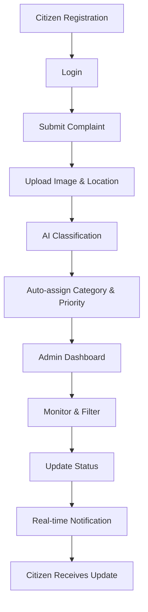

# 🏙️ Smart Urban Grievance & Service Response System

<div align="center">


**An AI-powered grievance management platform for smart cities**

[Features](#-features) • [Tech Stack](#-tech-stack) • [Quick Start](#-quick-start) • [Documentation](#-documentation)

</div>

---

## 📋 Overview

The Smart Urban Grievance & Service Response System is a comprehensive platform that enables citizens to submit complaints with images and location data. Using AI-powered categorization and priority assignment, the system streamlines complaint management for administrators with real-time updates and monitoring capabilities.

### ✨ Key Highlights

- 🤖 **AI-Powered Classification** - Automatic category and priority assignment
- 📍 **Location-Based** - GPS-enabled complaint submission
- 📸 **Image Upload** - Visual documentation of issues
- ⚡ **Real-Time Updates** - Live complaint status via Socket.IO
- 🔐 **Secure Authentication** - JWT-based user management
- 📊 **Admin Dashboard** - Comprehensive monitoring and filtering

---

## 🚀 Features

### For Citizens

- ✅ User registration and authentication
- ✅ Submit complaints with images and GPS location
- ✅ Track complaint status in real-time
- ✅ View complaint history

### For Administrators

- ✅ Real-time complaint monitoring
- ✅ Filter and search complaints
- ✅ Update complaint status
- ✅ AI-assisted categorization
- ✅ Priority-based queue management

---

## 🛠️ Tech Stack

### Frontend

- **Framework**: React.js
- **Styling**: Tailwind CSS
- **HTTP Client**: Axios
- **Routing**: React Router
- **Real-time**: Socket.IO Client

### Backend

- **Runtime**: Node.js
- **Framework**: Express.js
- **Database**: MongoDB Atlas
- **ODM**: Mongoose
- **Authentication**: JWT
- **File Storage**: Cloudinary
- **Real-time**: Socket.IO

### AI Service

- **Language**: Python (3.10 or 3.11)
- **Framework**: FastAPI
- **Server**: Uvicorn
- **Validation**: Pydantic

---

## 📦 System Requirements

Before you begin, ensure you have the following installed:

| Requirement    | Version      | Notes                            |
| -------------- | ------------ | -------------------------------- |
| Node.js        | v18+         | [Download](https://nodejs.org/)  |
| Python         | 3.10 or 3.11 | ⚠️ **Do NOT use 3.14**           |
| Docker         | Latest       | Optional for containerized setup |
| Docker Compose | Latest       | Optional for containerized setup |
| MongoDB Atlas  | -            | Cloud database access required   |

---

## ⚙️ Environment Configuration

### 🔑 Backend Configuration

Create `backend/.env`:

```env
# Server Configuration
PORT=5000

# Database
MONGO_URI=your_mongodb_atlas_connection_string

# Authentication
JWT_SECRET=your_jwt_secret_key

# Cloudinary Configuration
CLOUDINARY_CLOUD_NAME=your_cloud_name
CLOUDINARY_API_KEY=your_api_key
CLOUDINARY_API_SECRET=your_api_secret

# AI Service URL
# For Docker:
AI_SERVICE_URL=http://ai-service:8000
# For local development:
# AI_SERVICE_URL=http://localhost:8000
```

### 🎨 Frontend Configuration

Create `frontend/.env`:

```env
# Backend API URL
# For local development:
VITE_API_URL=http://localhost:5000
# For Docker:
# VITE_API_URL=http://backend:5000
```

## 🐳 Quick Start with Docker

### 1️⃣ Clone the Repository

```bash
git clone <repository-url>
cd <folder-name>
```

### 2️⃣ Set Up Environment Variables

Create all necessary `.env` files as described in the [Environment Configuration](#️-environment-configuration) section.

### 3️⃣ Clean Previous Containers (if any)

```bash
docker compose -f docker-compose.dev.yml down -v
```

### 4️⃣ Build Fresh Images

```bash
docker compose -f docker-compose.dev.yml build --no-cache
```

### 5️⃣ Start All Services

```bash
# Run in foreground (with logs)
docker compose -f docker-compose.dev.yml up

# OR run in background (detached mode)
docker compose -f docker-compose.dev.yml up -d
```

### 6️⃣ Access the Application

| Service         | URL                              | Description       |
| --------------- | -------------------------------- | ----------------- |
| 🌐 Frontend     | http://localhost:5173            | User interface    |
| 🔧 Backend API  | http://localhost:5000            | REST API          |
| 🤖 AI Service   | http://localhost:8000            | AI classification |
| 💚 Health Check | http://localhost:5000/api/health | System status     |

---

## 💻 Manual Setup (Without Docker)

### Prerequisites Check

```bash
# Check Node.js version
node --version  # Should be v18 or higher

# Check Python version
python --version  # Should be 3.10 or 3.11
```

### 1️⃣ Backend Setup

```bash
cd backend
npm install
npm run dev
```

✅ Backend will run on **http://localhost:5000**

### 2️⃣ AI Service Setup

#### Create Virtual Environment

```bash
cd ai-service
python -m venv venv
```

#### Activate Virtual Environment

**Windows:**

```bash
venv\Scripts\activate
```

**macOS/Linux:**

```bash
source venv/bin/activate
```

#### Install Dependencies

```bash
pip install -r requirements.txt
```

#### Start AI Service

```bash
uvicorn main:app --reload --port 8000
```

✅ AI Service will run on **http://localhost:8000**

### 3️⃣ Frontend Setup

```bash
cd frontend
npm install
npm run dev
```

✅ Frontend will run on **http://localhost:5173**

### ⚠️ Important: Service Start Order

For manual setup, start services in this order:

1. **Backend** (Port 5000)
2. **AI Service** (Port 8000)
3. **Frontend** (Port 5173)

---

## 🔄 Application Workflow



### Step-by-Step Process

1. **👤 Citizen Registration** - New users create an account
2. **📝 Submit Complaint** - Upload issue with image and GPS location
3. **🤖 AI Processing** - System automatically categorizes and prioritizes
4. **👨‍💼 Admin Review** - Administrators monitor incoming complaints
5. **🔍 Filter & Manage** - Sort by category, priority, or status
6. **✅ Update Status** - Change complaint status (pending → in-progress → resolved)
7. **🔔 Real-time Sync** - Citizens receive instant updates via Socket.IO

---

## 📚 Documentation

### API Endpoints

#### Authentication

- `POST /api/auth/register` - Register new user
- `POST /api/auth/login` - User login

#### Complaints

- `GET /api/complaints` - Get all complaints
- `POST /api/complaints` - Submit new complaint
- `PATCH /api/complaints/:id` - Update complaint status
- `GET /api/complaints/:id` - Get complaint details

#### Health Check

- `GET /api/health` - Check system status

### WebSocket Events

- `complaint:new` - New complaint submitted
- `complaint:update` - Complaint status updated
- `complaint:delete` - Complaint removed

---

## 🧪 Testing

### Backend Tests

```bash
cd backend
npm test
```

### Frontend Tests

```bash
cd frontend
npm test
```

### AI Service Tests

```bash
cd ai-service
pytest
```

---

## 🐛 Troubleshooting

### Common Issues

#### Docker Build Fails

```bash
# Clear Docker cache
docker system prune -a
docker compose -f docker-compose.dev.yml build --no-cache
```

#### Python Version Conflict

```bash
# Install specific Python version
pyenv install 3.11
pyenv local 3.11
```

#### Port Already in Use

```bash
# Find and kill process using port
# Windows
netstat -ano | findstr :5000
taskkill /PID <PID> /F

# macOS/Linux
lsof -ti:5000 | xargs kill -9
```

#### MongoDB Connection Issues

- Verify MongoDB Atlas connection string
- Check network access settings in MongoDB Atlas
- Ensure IP whitelist includes your current IP

---

## 🤝 Contributing

Contributions are welcome! Please follow these steps:

1. Fork the repository
2. Create your feature branch (`git checkout -b feature/AmazingFeature`)
3. Commit your changes (`git commit -m 'Add some AmazingFeature'`)
4. Push to the branch (`git push origin feature/AmazingFeature`)
5. Open a Pull Request

---

## 📄 License

This project is licensed under the MIT License - see the [LICENSE](LICENSE) file for details.

---

## 👥 Authors

- Your Name - Initial work - [YourGitHub](https://github.com/yourusername)

---

## 🙏 Acknowledgments

- MongoDB Atlas for cloud database
- Cloudinary for image storage
- FastAPI for AI service framework
- Socket.IO for real-time communication

---

## 📞 Support

For support, email your-email@example.com or open an issue in the repository.

---

<div align="center">

**Made with ❤️ for Smart Cities**

⭐ Star this repo if you find it helpful!

</div>
